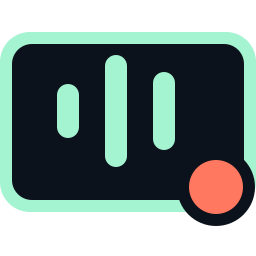
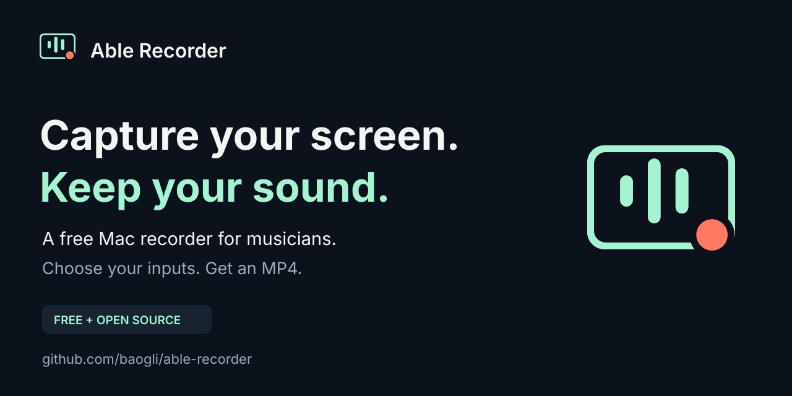

<p align="center"></p>

# Able Recorder

**Capture your screen. Keep your sound.**

A free, open-source Mac screen recorder for musicians. Choose a display, select an audio device and its left/right input channels, and record straight to a compressed MP4. Useful for DAW walkthroughs, production sessions, tutorials and performances you want to publish.

[Русский](README.ru.md) · [Get started](docs/QUICKSTART.md) · [Download](https://github.com/baogli/able-recorder/releases) · [Press kit](marketing/README.md)



## What it does

- Records any active display, including the monitor where your DAW is running.
- Lists macOS Core Audio input devices and lets you explicitly assign two hardware channels to stereo L/R. Select the same channel twice for mono.
- Reads your interface's hardware loopback when it is exposed as input channels. Also supports microphones and other Core Audio inputs.
- Offers a sound check with separate L/R peak meters before recording.
- Encodes H.264 or HEVC video and AAC stereo audio directly into MP4 while recording.
- Offers 1080p, 1440p, 2160p or native screen size; 30/60 fps; three quality presets and an estimated file size. Preserves aspect ratio without upscaling.
- Opens the relevant macOS screen/audio permission settings from the app.
- Starts/stops with **Control–Shift–R**, the window or the menu bar.
- Saves locally. No account, subscription, telemetry or upload service.

**This version records files; it does not broadcast a live stream.** “Any input” means an input device/channel exposed by macOS, not a promise that every audio interface has been tested. Hardware loopback must be available and configured on your interface. Able Recorder does not install a loopback driver or change your DAW routing.

## Requirements and download

macOS **14 Sonoma or later**, **Apple Silicon**. The current interface is in Russian. Intel can be compiled with `ARCH=x86_64`; Intel runtime capture has not been tested.

Version **0.2.0** is an early preview. The downloadable app is ad-hoc signed, without Apple Developer ID signing or notarization. macOS may require explicit approval through **System Settings → Privacy & Security**. Follow Apple's supported [opening guidance](https://support.apple.com/guide/mac-help/open-a-mac-app-from-an-unknown-developer-mh40616/mac); building from source is another option. No disabling of Gatekeeper is needed.

After extraction, move **Able Recorder.app** to your Applications folder and open it. Grant screen recording and microphone access (macOS uses microphone permission for interface loopback inputs too). The app has shortcuts to both settings panes.

## Record your first clip

1. Keep your DAW's output on your usual interface. Configure its loopback source if you want the DAW mix.
2. Select the display and input device in Able Recorder.
3. Assign the correct channels to **L** and **R**, press **Проверить звук** (Check sound), then play audio. Both meters should respond.
4. Choose **1080p / 30 fps / Для публикации / H.264** for a first web clip.
5. Press **Начать запись** (Start recording); stop with the same button or **Control–Shift–R**. Open **Последний MP4 ↗** (Last MP4) and check picture, stereo sound and sync.

For an **Audient iD14 MKII**, documented loopback inputs are **11/12**. In iD Mixer choose the DAW output pair used by your project, or the mix you need. Other interfaces can use different channel numbers. See the [routing guide](docs/QUICKSTART.md).

By default, recordings go to `~/Movies/Able Recorder`. A recording is named `.partial.mp4` until successful finalization. Abrupt process termination or loss of power can leave an unplayable partial file. Use the app's Quit command while recording so it can finish the container.

## Build and verify

Install Xcode command line tools, clone this repository, then:

```sh
./build.sh
open "build/Able Recorder.app"
"build/Able Recorder.app/Contents/MacOS/AbleRecorder" --self-test "$PWD/Tests/output"
```

No package dependencies or audio drivers are required. The build uses Swift, C and Apple's system frameworks. `./scripts/package.sh` creates a versioned app ZIP and SHA-256 checksum. See [contributing](CONTRIBUTING.md) and [architecture/testing](docs/DEVELOPMENT.md).

Synthetic tests encode and fully decode H.264/HEVC MP4s, check timing, stereo isolation, sample-rate conversion and fast-start layout. Local physical capture has been checked with one Mac and one interface. A musical Ableton session on a second display remains a user acceptance test; see [verified coverage](docs/TESTING.md).

## License and independence

Code and original brand artwork: [MIT](LICENSE). The bundled Inter font uses its separate [SIL Open Font License](marketing/fonts/OFL.txt). Tesseract design files are editable assets; the Tesseract development CLI is not bundled with the app.

Able Recorder is an independent project. It is not affiliated with, endorsed by, or an official product of Ableton or any audio-interface manufacturer.
