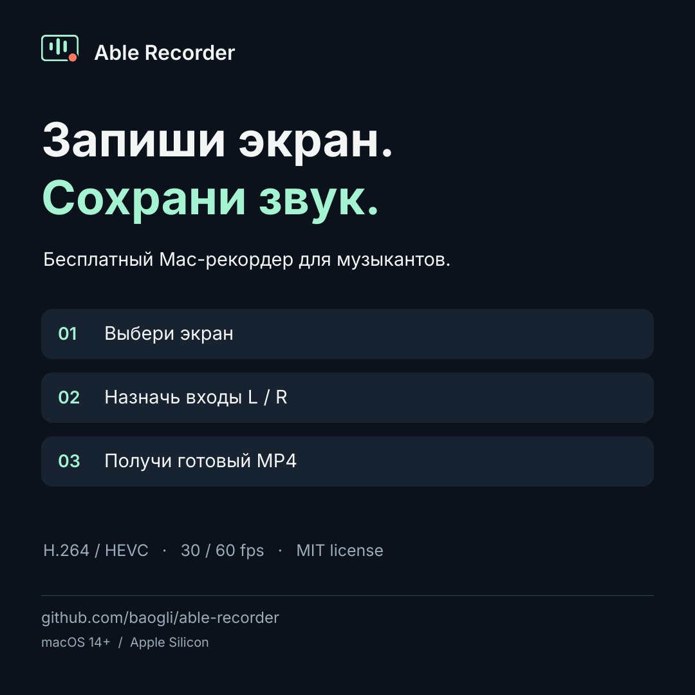

# Able Recorder · Эйбл рекордер

**Запиши экран. Сохрани звук.**

Бесплатный Mac-рекордер с открытым кодом для музыкантов. Выбери экран, аудиоустройство и входы L/R — получи сжатый MP4 для публикации. Подходит для разбора проектов в DAW, уроков, демонстрации плагинов и записи музыкального процесса.

[Скачать](https://github.com/baogli/able-recorder/releases) · [English](README.md) · [Настройка](docs/QUICKSTART.md) · [Маркетинговый комплект](marketing/README.md)



## Возможности

- Выбор активного экрана, включая внешний монитор с Ableton.
- Выбор доступного macOS аудиовхода: аудиокарта, аппаратный loopback, микрофон или виртуальное устройство.
- Явное назначение входных каналов на L/R. Одинаковый вход в обоих каналах даёт моно.
- Проверка звука и отдельные индикаторы L/R до записи.
- MP4 сразу во время захвата: H.264 / HEVC, AAC stereo 48 kHz / 256 кбит/с.
- 1080p / 1440p / 2160p / размер экрана, 30 или 60 fps, три пресета качества и оценка размера файла. Без увеличения маленького экрана; пропорции сохраняются.
- Кнопки перехода прямо к настройкам доступа к экрану и аудио.
- Запуск и остановка кнопкой, через строку меню или **Ctrl+Shift+R**.
- Локальные файлы, без аккаунта, подписки и телеметрии.

Версия 0.2.0 записывает видеофайлы и **пока не ведёт прямые эфиры**. Под «любым входом» подразумеваются доступные macOS Core Audio устройства и каналы. Совместимость со всеми моделями карт не проверена. Аппаратный loopback настраивается в микшере карты; программа не устанавливает аудиодрайвер и не меняет маршрутизацию Ableton.

## Первый запуск

Нужны **macOS 14+ и Apple Silicon**. Интерфейс сейчас на русском. Это ранняя версия: приложение подписано ad hoc, без Developer ID и нотарификации Apple. macOS может попросить разрешить открытие через **Системные настройки → Конфиденциальность и безопасность**. Используй штатный путь macOS или собери из исходников.

1. Распакуй ZIP и перенеси **Able Recorder.app** в «Программы».
2. Разреши запись экрана и «Микрофон». Второе разрешение нужно и для loopback-входов карты. Кнопки в приложении открывают нужные разделы настроек; macOS может попросить перезапуск.
3. Выбери экран и аудиоустройство. Назначь правильные входы L/R.
4. Включи **Проверить звук** и музыку в DAW. Оба индикатора должны реагировать.
5. Для первого клипа выбери **1080p, 30 fps, Для публикации, H.264**. Запиши 10 секунд, останови и проверь готовый MP4.

Для **Audient iD14 MKII** loopback — входы **11/12**. В iD Mixer выбери источник DAW, на который выводит Ableton, либо нужный микс. На других картах номера могут отличаться. У iD14 MKI аппаратного loopback нет. Подробности — в [инструкции](docs/QUICKSTART.md).

По умолчанию запись сохраняется в `~/Movies/Able Recorder`; папку можно сменить. Готовый MP4 появляется после остановки и завершения контейнера. При аварийном выключении `.partial.mp4` может не воспроизводиться.

## Сборка

```sh
./build.sh
open "build/Able Recorder.app"
"build/Able Recorder.app/Contents/MacOS/AbleRecorder" --self-test "$PWD/Tests/output"
```

Нужны Xcode command line tools. Внешние зависимости и драйверы не требуются. Подробнее: [разработка](docs/DEVELOPMENT.md), [проверки](docs/TESTING.md), [MIT-лицензия](LICENSE).

Приложение проверено на синтетических MP4 и локальном захвате одного Mac с аудиокартой. Полноценная запись музыки из Ableton на втором мониторе ещё требует пользовательского теста. Able Recorder — независимый проект, не официальный продукт Ableton.
